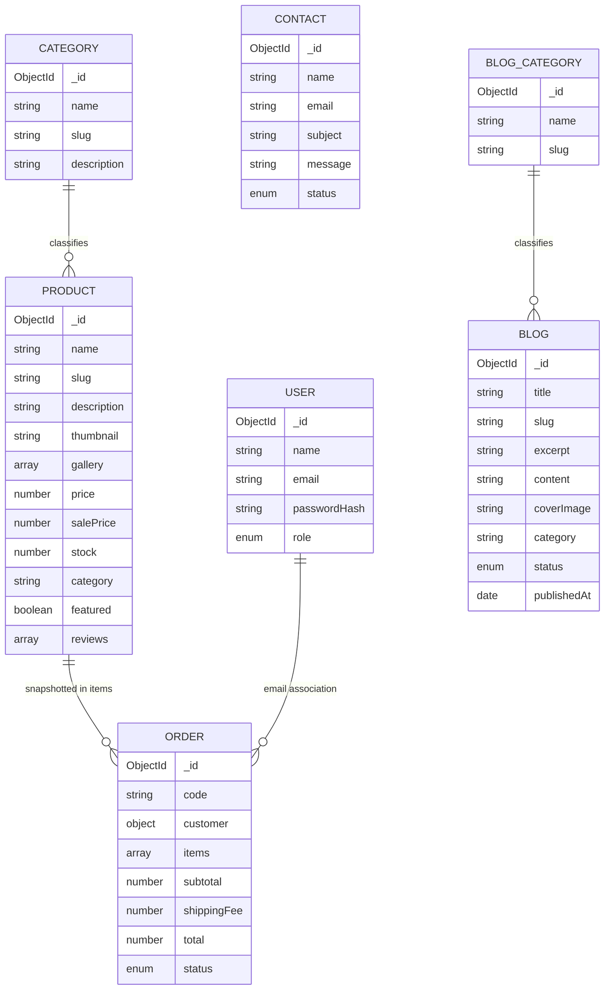

# ERD — Mojuri MongoDB

MongoDB lưu `Order.items` dưới dạng snapshot để tên, giá và ảnh của đơn cũ không đổi khi sản phẩm được cập nhật. Review được nhúng trong Product vì luôn được đọc cùng chi tiết sản phẩm. Category được tham chiếu bằng tên để dữ liệu seed và bộ lọc client đơn giản, còn `_id` của Product được lưu trong từng order item để cập nhật tồn kho.

## Index và ràng buộc

- Unique: `User.email`, `Product.slug`, `Category.name/slug`, `Order.code`, `Blog.slug`, `BlogCategory.name/slug`.
- Enum: role, order status, contact status, blog status.
- Validation request dùng Zod trước khi Mongoose thực hiện schema validation.
- Xóa/hủy đơn không xóa snapshot; trạng thái Cancelled tự hoàn tồn kho.
